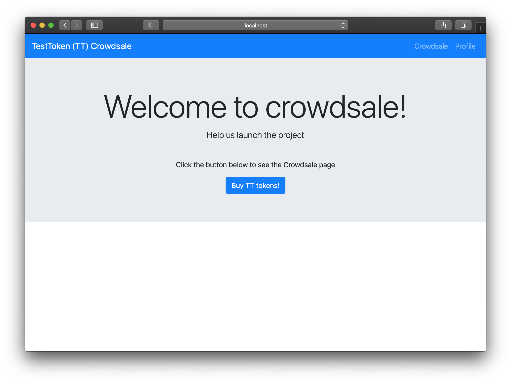
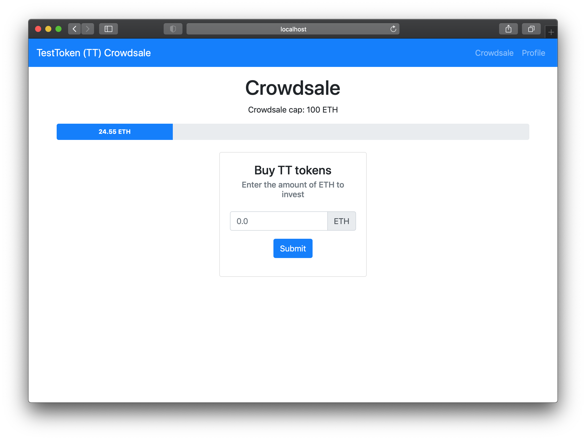
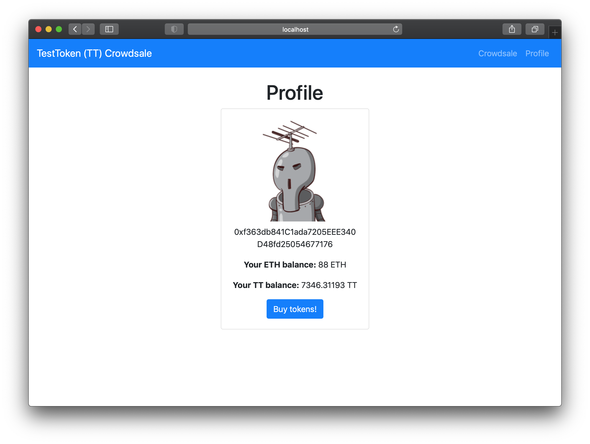

# An example Vue Drizzle token crowdsale dApp

> Say "hello" [here](https://github.com/remote-gildor/vue-drizzle-crowdsale/issues/2), if you like this repo/project :)

## Setup

### Install truffle

[Truffle](https://www.trufflesuite.com/truffle) is a **framework** for developing Ethereum dApps:

```bash
npm install truffle -g
```

### Install Ganache

Ganache is a **localhost simulator** of the Ethereum blockchain/network. 

I recommend using Ganache with GUI (but you can also use a CLI version instead if you want): [https://www.trufflesuite.com/ganache](https://www.trufflesuite.com/ganache).

### Install MetaMask

MetaMask is a **browser extension** for Firefox and Chromium-based browsers (Chrome, Brave, Edge, Opera, etc.)

Download link: [https://metamask.io/download.html](https://metamask.io/download.html)

Once you install MetaMask, create an Ethereum account on it (make sure to save the 12 seed words). 

After that, import a private key of an account on Ganache (click the key icon on the right-side of Ganache next to each account). This way you'll have two accounts on MetaMask.

> Each Ganache Ethereum account gets 100 (fake) ether. I recommend sending some of that Ether to your non-Ganache MetaMask Ethereum account. Make sure you're doing this on the Ganache network in MetaMask, not on the Mainnet (see instructions below).

**Important: Set up Ganache network on MetaMask**

In MetaMask, click on the Networks dropdown at the top of MetaMask (it probably says "Mainnet" right now) and select Custom RPC. Then add the Ganache data in the form:

- Network Name: Ganache
- New RPC URL: http://127.0.0.1:7545
- Click **Save**

Now you can connect to the Ganache localhost network using your MetaMask (select Ganache in the Networks dropdown).

### Download this repo and run npm install

Download this repo and then run `npm install` in root and in `/vapp`:

```bash
npm install

cd vapp
npm install
```

### Run the dApp

Make sure the Ganache has started (you can use the quickstart).

Then run the compile and migrate commands in the root of the project:

```bash
truffle compile
truffle migrate
```

Finally navigate to the `/vapp` folder and run the Vue app:

```bash
cd vapp
npm run serve
```

## Smart contracts in the repo

- TestToken
- TestCrowdsale

## Dependencies (npm)

- Vue
- Drizzle & Drizzle Vue Plugin
- Vuex
- Vue Router
- Vue Bootstrap
- Vue Toasted
- Vue Gravatar

## Screenshots

### Home page



### Crowdsale page



### Profile page



## Contract calls

There are different ways of getting data from a contract:

### Using getContractData

**JavaScript:**

```javascript
computed: {
  ...mapGetters("drizzle", ["isDrizzleInitialized", "drizzleInstance"]),
  ...mapGetters("accounts", ["activeAccount", "activeBalance"]),
  ...mapGetters("contracts", ["getContractData"]),

  getTestTokenBalance() {
    window.console.log(this.activeAccount);

    return this.getContractData({
      contract: "TestToken",
      method: "balanceOf",
      methodArgs: [this.activeAccount]
    });
  }
},
created() {
  this.$store.dispatch("drizzle/REGISTER_CONTRACT", {
      contractName: "TestToken",
      method: "balanceOf",
      methodArgs: [this.activeAccount]
  });
}
```

**HTML:**

```html
<p>Your token balance : {{ getTestTokenBalance }} TT</p>
```

### Using an ordinary web3 call()

Another option is to use custom Vuex store and a normal web3 call():

```javascript
const actions = {
  async fetchTestTokenBalance({ commit, rootState }) {
    let drizzleInstance = rootState.drizzle.drizzleInstance;
    let activeAccount = rootState.accounts.activeAccount;

    // get token balance for the active user
    const smallUnitBalance = await drizzleInstance.contracts.TestToken.methods.balanceOf(activeAccount).call()

    // remove the 18 decimals and commit as balance
    commit("setTestTokenBalance", drizzleInstance.web3.utils.fromWei(smallUnitBalance, "ether"));
  }
};
```

You can see the rest od the implementation in this repository (`vapp/src/store/modules/profile.js` and `vapp/src/views/Profile.vue`).

## Tests

### Solidity tests

Run Solidity tests with Truffle:

```bash
truffle test
```

## TODO

- Implement Web3Modal
- Write Vue tests
- etc.
